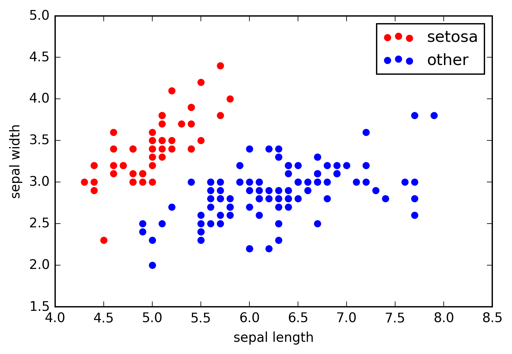
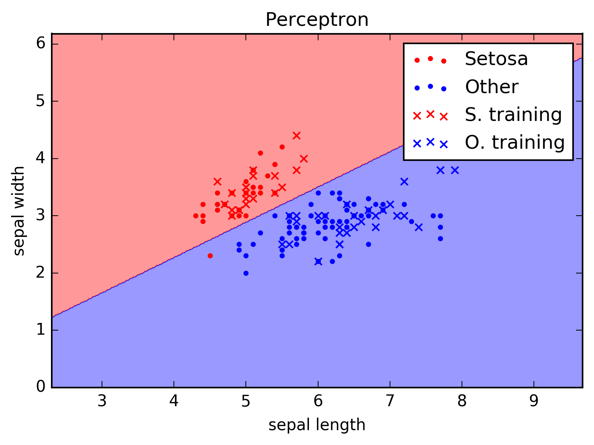
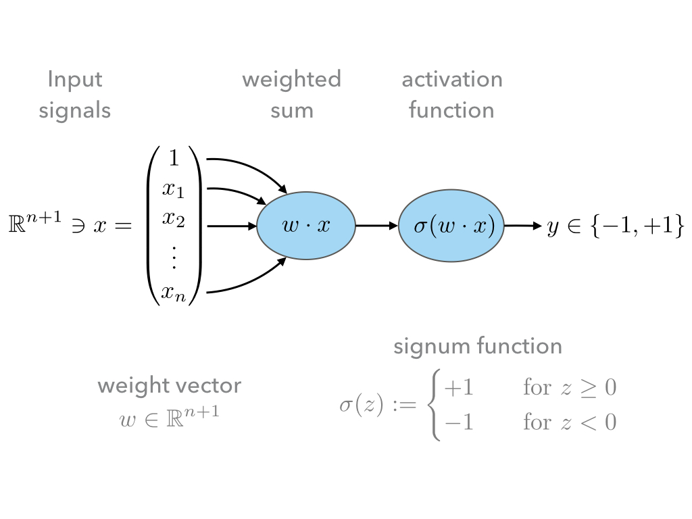
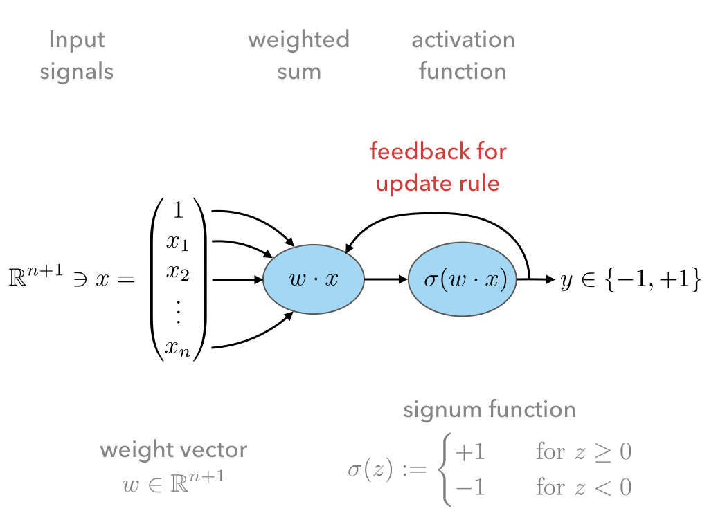

.. highlight:: python
   :linenothreshold: 3

.. _FirstSteps:

First steps: Linear Classifiers
===============================

Two traditional machine learning models for linear classifications are:

* The *Perceptron* and
* The *Adaptive Linear Neuron*.

The ideas for these two models go back to 

* McCulloh & Pitts (1943) :cite:`mcculloch_logical_1943`
* Rosenblatt (1957) :cite:`rosenblatt_perceptron_1957`
* Widrow (1960) :cite:`widrow_adapting_1960`

These models provide a good entry point also for modern machine learning algorithms as:

* They are very simple;
* but also generalizes to the modern *deep networks*.

This section is inspired by the introductory chapters of the book :cite:`raschka_python_2015`.

Binary Classification Problems
------------------------------

As an example of a typical of a binary classification problem let us consider:

* A sequence of :math:`N` data points :math:`x^{(i)}\in\mathbb R^n, 1\leq i\leq
  N`; 
* each having :math:`n` characteristic features
  :math:`x^{(i)}=(x^{(i)}_1,x^{(i)}_2,\ldots,x^{(i)}_3)`;
* and the task to assign to each element :math:`x^{(i)}` a label :math:`y^{(i)}\in\{-1,+1\}`;
* thereby dividing the data points into two classes labeled :math:`-1` and :math:`+1`. 
            

    Labelled 2d example data points (:math:`x^{(i)}\in\mathbb R^2`) describing
    the sepal length and width (:math:`x^{(i)}_1` and :math:`x^{(i)}_2`,
    respectively) of species of the iris flower. The respected class labels
    'setosa' and 'other', i.e., :math:`y^{(i)}\in\{-1,+1\}`, are encoded in the
    colors red and blue.

The goal of the classification problem is, given some pre-labeled training data:

.. math::
   (x^{(i)},y^{(i)})_{1\leq i\leq M}, \qquad M\leq N 

to find a function

.. math::
    f:\mathbb R^n \to \{-1,+1\}

that:

* predicts *accurately* the labels of pre-labeled training data
  :math:`(x^{(i)},y^{(i)})_{1\leq i\leq M}`, i.e.,  for most indices
  :math:`i\in\{1,\ldots,M\}` it should hold :math:`f(x^{(i)})=y^{(i)}`;
* and *generalizes* well to unknown data.

A general approach to this problem is to specify a space of candidates for
:math:`f`, the hypothesis set. Then the art of the game is to find sensible
mathematical counterparts for the vague terms 'accurately' and 'generalizes'
and to find, in that sense, optimal functions :math:`f`. 

* Typically one tries to find an appropriate parametrization of the hypothesis set,
  so that the search for an optimal :math:`f` can then be recast into a search
  for optimal parameters;
* In which sense parameters are better or worse than others is usually encoded
  by a real-valued function on this parameter space which depends on the training data, 
  often called 'loss', 'regret', 'energy' or 'error' function;
* The search for optimal parameters is then recast into a search of minima of
  this loss function.

One calls the classification problem linear if the data points of the two
classes can be separated by a hyperplane. 

The following plot shows the data points of the iris data set shown above with
a possible hyperplane as decision boundary between the two different classes.

    Decission boundaries for a possible classification function
    :math:`f`. The dots denote unknown data points and the crosses denote
    pre-labeled data points which were used to train the machine learning model
    in order to find an optimal :math:`f`.

Note that although the classification of the pre-labeled data points (the
crosses) seems to be perfect, the classification of the unknown data (points)
is not. This may be due to the fact that either:

* the data is simply not separable using just a hyperplane, in which case one
  calls the problem 'non-linear classification problem',
* or there are errors in the pre-labeled data.

It is quite a typical situation that a perfect classification is not possible.
It is therefore important to specify mathematically in which sense we allow for
errors and what can be done to minimize them -- this will be encoded in the
mathematical sense given to 'accurately' and 'generalizes', i.e., in terms of
the loss function, as discussed above.

In the following we will specify two senses which lead to the model of the
Perceptron and Adaline.

Perceptron
^^^^^^^^^^

The first model we will take a look is the so-called Perceptron model.
It is a mathematical model inspired by a nerve cell:

.. figure:: ./figures/MultipolarNeuron.png
    :width: 80%
    :align: center

    A sketch of a neuron (`source <https://commons.wikimedia.org/wiki/File:Blausen_0657_MultipolarNeuron.png>`_).

The mathematical model can be sketched as follows:

* The input signals are given as a vector :math:`x\in\mathbb R^{n+1}`;
* These input signals are weighted by the weight vector :math:`w\in\mathbb R^{n+1}`,
* and then summed to give :math:`w\cdot x`.
* The first coefficient in the input vector :math:`x` is always assumed to be
  one, and thus, the first coefficient in the weight vector :math:`w` is
  a threshold term, which renders :math:`w\cdot x` an *affine linear* as opposed to a 
  just *linear* map.
* Finally signum function is employed to infer from :math:`w\cdot x\in\mathbb
  R` discreet class labels :math:`y\in\{-1,+1\}`.

This results in a hypothesis set of function :math:`f_w`

.. math::
    f_w:\mathbb R^{n+1} &\to \{-1,+1\}\\
    x &\mapsto \sigma(w\cdot x)
    :label: eq-lin-model

for all :math:`w\in\mathbb R^{n+1}`, where we shall often drop the subscript
:math:`w`. 

Since, our hypothesis set only contains linear functions, we may only expect it
to be big enough for linear (or approximately) linear classification problems.

.. note:: 

    * In the previous section the data points
      :math:`x^{(i)}=(x^{(i)}_1,\ldots,x^{(i)}_n)` were assumed to be from
      :math:`\mathbb R^n` and :math:`f` was assumed to be a :math:`\mathbb
      R^n\to\{-1,+1\}` function; 
    
    * A linear activation thus would amount to a function of the form

        .. math::
            f(x) = w \cdot x + b

      for weigths :math:`w\in\mathbb R^n` and threshold :math:`b\in\mathbb R`;

    * In the following absorb the threshold :math:`b` into the weight vector
      :math:`w` and therefore add the coefficient :math:`1` at the first position of
      all data vectors :math:`x^{(i)}`, i.e.

        .. math::
            \tilde x &= (1, x) = (1, x_1, x_2, \ldots, x_n),\\
            \tilde w &= (w_0, w) = (w_0, w_1, w_2, \ldots, w_n) = (b, w_1, w_2,\ldots, w_n);

    * so that 
        
        .. math::
            \tilde w\cdot \tilde x = w\cdot x + b.

    * Instead of an overset tilde, we will use the following convention to
      distinguish between vectors in :math:`\mathbb R^{n+1}` and :math:`\mathbb R^n`:

        .. math::
        	\mathbb R^{n+1} \ni x &= (1, \mathbf x) \in \mathbb R\times\mathbb R^n \\
        	\mathbb R^{n+1} \ni w &= (w_0, \mathbf w) \in \mathbb R\times\mathbb R^n

      and unless 
    
**Example:**  The bitwise AND-gate

    Let us pause and consider what such the simple model :eq:`eq-lin-model` is
    able to describe. This is a question of whether our hypothesis set is big
    enough to contain a certain function.

    The bitwise AND-gate operation is given by following table:

    =======  =======  ======
    Input 1  Input 2  Output
    =======  =======  ======
    0        0        0
    0        1        0
    1        0        0
    1        1        1
    =======  =======  ======

    * In order to answer the question, whether out hypothesis set is big enough
      to model the AND-gate, it is helpful to represent the above table as
      a graph similar to the iris data above. 
    
    * The features of each data point :math:`x^{(i)}` are the two input signals
      and the output value 0 and 1 are encoded by the class labels
      :math:`y^{i}\in\{-1,+1\}`.

    .. plot:: ./figures/python/and-gate.py
        :width: 80%
        :align: center

    * The colors: red and blue denote the output values 0 or 1 of the AND-gate.;
    * Note that the data points a linearly sperable;
    * Note that these two classes of data points can be well separated by
      a hyperplane (in this case a line ☺). Hence, it is easy to find a  *good*
      weight vector :math:`w`. For instance:

    .. math::
        w 
        = 
        \begin{pmatrix}
            -1.5\\
            1\\
            1
        \end{pmatrix}.
        :label: eq-weight-vector

    .. container:: toggle
            
        .. container:: header
        
            Homework

        .. container:: homework

            1. Check if :math:`f` in :eq:`eq-lin-model` with the weight vector
               given in :eq:`eq-weight-vector` decribes an AND-gate correctly and
               note that :math:`w` is by no means unique.
               
            2. Give a geometric interpretation of the :math:`w`.

            3. Check all 16 bitwise logic gates and note which can be 'learned'
               by the model :eq:`eq-lin-model` and which not -- in the latter case, discuss
               why not.

Learning rule
"""""""""""""

Having settled for a hypothesis set such as :math:`f` in :eq:`eq-lin-model`,
the task is to learn a *good* parameters, i.e., in our case a *good* weight
vector :math:`w`, in the sense discussed in the previous section.

* This is now done by adjusting the weight vector :math:`w` appropriately
  depending on the training data :math:`(x^{(i)},y^{(i)})_{1\leq i\leq M\leq
  N}`,
* in a way that minimizes the classification errors, i.e., the number of indices :math:`i` for which
  :math:`f(x^{(i)})\neq y^{(i)}`.

The algorithm by which the 'learning' is facilitated shall be called *learning
rule* and can be spell out as follows:

**INPUT:** Pre-labeled training data :math:`(x^{(i)},y^{(i)})_{1\leq i\leq M\leq N}`

    **STEP 1:** Initialize the weight vector :math:`w` to zero or conveniently
    distributed random coefficients.

    **STEP 2:** Pick a data point :math:`(x^{(i)},y^{(i)})` in the training samples at random:
    
        a) Compute the output

            :math:`y = f(x^{(i)})`

        b) Compare :math:`y` with :math:`y^{(i)}`:
        
            If :math:`y=y^{(i)}`, go back to **STEP 2**.

            Else, update the weight vector :math:`w` *appropriately* according to an *update rule*, 
            and go back to **STEP 2**. 

The following sketch is a visualization of the feedback loop for the learning rule:

The important step is the *update rule* which we discuss next.

Update rule
"""""""""""

Let us spell out a possible update rule and then discuss why it does what we want:

    First, we compute the difference between the correct label :math:`y^{(i)}`
    given by the training data and the prediction :math:`y=f(x^{(i)})`:

    .. math::
        \Delta^{(i)} := y^{(i)} - y
        :label: eq-delta

    Second, we perform an update of the weight vector as follows:

    .. math::
        w \mapsto \tilde w := w + \delta w
        :label: eq-update-weight

    where

    .. math::
        \delta w := \eta \, \Delta^{(i)} \, x^{(i)}.
        :label: eq-delta-weight

    The parameter :math:`\eta\in\mathbb R^+` is called 'learning rate'.

Why does this update rule lead to a *good* choice of weights :math:`w`?

    Assume that in **STEP 2** b. of the learning rule identified
    a misclassification and calls the update rule. There are two possibilities:

    1. :math:`\Delta=2`: This means that the model predicted :math:`y=-1`
       although the correct label is :math:`y^{(i)}=1`. 
       
        * Hence, by definition of :math:`f` in :eq:`eq-lin-model` the value
          of :math:`w\cdot x^{(i)}` is too low;
        * This can be fixed by adjusting the weights according to :eq:`eq-update-weight`
          and :eq:`eq-delta-weight`;
        * Next time when this data point is examined one finds

            .. math::
                \tilde w \cdot x^{(i)} &= (w + \delta w)\cdot x^{(i)}\\
                                       &= w \cdot x^{(i)} + \eta \, \Delta \, (x^{(i)})^2
                                       &\geq w \cdot x^{(i)} 

          because, as :math:`\Delta > 0` and the square is non-negative,
          the last summand on the right is positive.
        * Hence, the new weight vector is changed in such a way that, next time, it is more
          likely that :math:`f` will predict the label of :math:`x^{(i)}` correctly.

    2. :math:`\Delta=-2`: This means that the model predicted :math:`y=1`
       although the correct label is :math:`y^{(i)}=-1`.  

        * By the same reasoning as in case 1. one finds: 
            
            .. math::
                \tilde w \cdot x^{(i)} &= (w + \delta w)\cdot x^{(i)}\\
                                       &= w \cdot x^{(i)} + \eta \, \Delta \, (x^{(i)})^2
                                       &\leq w \cdot x^{(i)} 

          because now we have :math:`\Delta < 0`, and again, the correction
          works in the right direction.

The model :eq:`eq-lin-model` for :math:`f`, i.e., hypothesis set, and this
particular learning and update rule is what defines the 'Perceptron'.

Convergence
"""""""""""

Now that we have a heuristic understanding why the learning and update rule
chosen for the Perceptron works, we have a look at what can be said
mathematically; see :cite:`varga_neural_1996` for a more detailed discussion.

First let us make precise what we mean by 'linear separability':

.. container:: definition

    **Definition: (Linear seperability)** Let :math:`A,B` be two sets in :math:`\mathbb R^n`. Then:

    1. :math:`A,B` are called *linearly seperable* iff there is a
    
        :math:`w\in\mathbb R^{n+1}` such that

            .. math:: 
                \forall\, \mathbf a\in A,\,\mathbf b\in B: 
                \quad 
                w\cdot a \geq 0 \quad \wedge 
                \quad
                w\cdot b < 0.

    2. :math:`A,B` are called *absolutely linearly seperable* iff there is a

        :math:`w\in\mathbb R^{n+1}` such that

            .. math:: 
                \forall\, \mathbf a\in A,\,\mathbf b\in B: 
                \quad 
                w\cdot a > 0 \quad \wedge 
                \quad
                w\cdot b < 0.

The learning and update rule algorithm of the Perceptron can be formulated in
terms of the following algorithm:

.. container:: algorithm

    **Algorithm: (Perceptron)** 

        **PREP:** 
        
            Prepare the training data :math:`(\mathbf x^{(i)},y^{(i)})_{1\leq
            i\leq M}`. Let :math:`A` and :math:`B` be the sets of elements
            :math:`x^{(i)}\in\mathbb R^{n+1}=(1,\mathbb x^{(i)})` whose class labels
            fulfill :math:`y^{(i)}=+1` and :math:`y^{(i)}=-1`, respectively.

        **START:** 
        
            Initialize the weight vector :math:`w^{(0)}\in\mathbb R^{n+1}` with
            random numbers and set :math:`t:=0`.

        **STEP:** 
        
            Choose :math:`x\in'\mathbb \in A,B` at random:

            * If :math:`x\in A, w^{(t)}\cdot x \geq 0`: goto **STEP**.
            * If :math:`x\in A, w^{(t)}\cdot x < 0`: goto **UPDATE**.
            * If :math:`x\in B, w^{(t)}\cdot x \leq 0`: goto **STEP**.
            * If :math:`x\in B, w^{(t)}\cdot x > 0`: goto **UPDATE**.

        **UPDATE:** 
        
            * If :math:`x\in A`, then set :math:`w^{(t+1)}:=w^{(t)} + x`,
              increment :math:`t\mapsto t+1`, and goto **STEP**.
            * If :math:`x\in B`, then set  :math:`w^{(t+1)}:=w^{(t)} - x`,
              increment :math:`t\mapsto t+1`, and goto **STEP**.

* Note that for an implementation of this algorithm we will also need an exit
  criterion so that the algorithm does not run forever. 

* This is usually done by specifying how many times the entire training set
  is run through **STEP**, a number which is often referred to as number of
  *epochs*.

* Note further, that for sake of brevity , the learning rate :math:`eta` was
  chosen to equal :math:`1/2`.

Frank Rosenblatt already showed convergence of the algorithm above in the case of finite and linearly separable training data:

.. container:: theorem

    **Theorem: (Perceptron convergence)**

        Let :math:`A,B` be finite sets and linearly seperable, then the number of updates performed by the Perceptron algorithm stated above is finite.

    .. container:: toggle
            
        .. container:: header
        
            Proof

        .. container:: proof

            * As a first step, we observe that since :math:`A,B` are finite
              sets that are linear seperable, they are also absolutely
              seperable due to:

            .. container:: theorem

                **Proposition:**

                Let :math:`A,B` be finite sets of :math:`\mathbb R^{n+1}`:
                :math:`A,B` are linearly seperable :math:`\Leftrightarrow`
                :math:`A,B` are absolutely linearly seperable.
                
                .. container:: toggle
                        
                    .. container:: header
                    
                        Proof

                    .. container:: proof

                        Homework.

            * Furthermore, we observe that without restriction of generality
              (WLOG) we may assume the vectors :math:`x\in A\cap B` to be
              normalized because
              
                .. math::
                    w\cdot x > 0 \,  \vee \, w\cdot x < 0 
                    \Leftrightarrow 
                    w\cdot \frac{x}{\|x\|} > 0 \,  \vee \, w\cdot \frac{x}{\|x\|} < 0.

            * Let us define :math:`T=A\cap (-1)B`, i.e., :math:`T` is the union
              of :math:`A` and the element of :math:`B` times :math:`(-1)`.

            * Since :math:`A,B` absolutely linearly seperable there is a
              :math:`w^*\in\mathbb R^{n+1}` such that for all :math:`x\in T`

                .. math::
                    w^{*}\cdot x > 0.
                    :label: eq-abs-lin

              And moreover, we also may WLOG assume that :math:`w^{*}` is normalized.

            Let us assume that some time after the :math:`t`-th update a point
            :math:`x\in T` is picked in **STEP** that leads to a
            misclassification

                .. math::
                    w^{(t)} \cdot x < 0

            so that **UPDATE** will be called which updates the weight vector according to

                .. math::
                    w^{(t+1)} := w^{(t)} + x.

            Note that both cases of **UPDATE** are treated with this update since in the definition of :math:`T` we have already included the 'minus' sign.

            Now in order to infer a bound on the number of update :math:`t` in the
            Perceptron algorithm above, consider the quantity

                .. math::
                    1\leq \cos \varphi = \frac{w^{*}\cdot w^{(t+1)}}{\|w^{(t+1)}\|}.
                    :label: eq-denum

            To bound this quantity also from below, we consider first:

                .. math::
                    w^{*}\cdot w^{(t+1)} = w^{*}\cdot w^{(t)} + w^{*}\cdot x.

            Thanks to :eq:`eq-abs-lin` and the finiteness of :math:`A,B`, we know that

                .. math:
                    \delta := \min\{w\cdot x \,|\, x \in T\} > 0.
                    :math: eq-delta

            This facilitates the estimate
                
                .. math::
                    w^{*}\cdot w^{(t+1)} \leq  w^{*}\cdot w^{(t)} + \delta,

            which, by induction, gives

                .. math::
                    w^{*}\cdot w^{(t+1)} \leq  w^{*}\cdot w^{(0)} + (t+1)\delta.
                    :label: eq-ing-1

            Second, we consider the denumerator of :eq:`eq-denum`:

                .. math:
                    \| w^{(t+1)} \|^2 = \|w^{(t)}\|^2 + 2 w^{(t)}\cdot x + \|x\|^2.

            Recall that :math:`x` was misclassified by weight vector :math:`w^{(t)}` so that :math:`w^{(t)}\cdot x<0`. This yields the estimate
                
                .. math:
                    \| w^{(t+1)} \|^2 \geq  \|w^{(t)}\|^2 + \|x\|^2.

            Again by induction, and recalling the assuption that :math:`x` was normalized, we get:

                .. math:
                    \| w^{(t+1)} \|^2 \geq  \|w^{(0)}\|^2 + (t+1).
                    :label: eq-ing-2

            Both bounds, :eq:`eq-ing-1` and :eq:`eq-ing-1`, together with
            :eq:zeq-denum`, give rise to the inequalities

                .. math::
                    1 \leq \frac{w^{*}\cdot w^{(t+1)}}{\|w^{(t+1)}\|} 
                    \leq
                    \frac{w^{*}\cdot w^{(0)} + (t+1)\delta}{\sqrt{\|w^{(0}\|^2 + (t+1)}}.
                    :label: eq-fin-est

            The right-hand side would grow :math:`O(\sqrt t)` but has to be smaller one. Hence, :math:`t`, i.e., the number of updates, must be bounded by a finite number.

.. container:: toggle
        
    .. container:: header
    
        Homework

    .. container:: homework

        1. What is the geometrical meaning of :math:`\delta` in :eq:`eq-delta`
           in the proof above?

        2. Consider the case :math:`w^{(0)}=0` and give an upper bound on the
           maximum number of updates.

        3. Carry out the analysis above including an arbitrary learning rate
           :math:`\eta`. How does :math:`\eta` influence the number of
           updates?

Finally, though this result is reassuring it needs to be emphasized that it is
rather academic. 

* The convergence theorem only holds in the case of linear separability of the
  test data, which in most interesting cases is not given.

Python implementation 
"""""""""""""""""""""

Next, we discuss an Python implementation of the Perceptron discussed above.

* The mathematical model of the function :math:`f`, i.e., the hypothesis set,
  the learning and update rule will be implemented as a Python class::

    class Perceptron:

        def __init__(self, num):
            '''
            initialize class for `num` input signals
            '''

            # weights of the perceptron, initialized to zero
            # note the '1 + ' as the first weight entry is the threshold
            self.w_ = np.zeros(1 + num)

            return

* The constructor ``__init__`` takes as argument the number of input signals
  ``num`` and initializes the variable ``w_`` which will be used to store the
  weight vector :math:`w\in\mathbb R^{n+1}` where :math:`n=` ``num``.

  The constructor is called when an object of the ``Perceptron`` class is created, e.g., by::

    ppn = Perceptron(2)

  In this example, it initializes a Perceptron with :math:`n=2`.

* The first method ``activation_input`` of the Perceptron class takes as
  argument an array of data points ``X``, i.e., :math:`(x^{(i)})_i`, and
  returns the array of input activations :math:`w\cdot x^{(i)}` for all
  :math:`i` using the weight vector :math:`w` stored in variable ``w_``::

    def activation_input(self, X):
        '''
        calculate the activation input of the neuron
        '''
        return np.dot(X, self.w_[1:]) + self.w_[0]

* The second method ``classify`` takes again an array of data points ``X``,
  i.e., :math:`(x^{(i)})_i` as argument. It uses the previous method
  ``input_activation`` to compute the input activations :math:`(w\cdot
  x^{(i)})_i` and then applies the signum function to the values in the arrays::

    def classify(self, X):
        '''
        classify the data by sending the activation input through a step function
        '''
        return np.where(self.activation_input(X) >= 0.0, 1, -1)

  This method is the implantation of the function :math:`f` in :eq:`eq-lin-model`.

* Finally, the next method implements the learning and update rule::

    def learn(self, X_train, Y_train, eta=0.01, epochs=10):
        '''
        fit training features X_train with labels Y_train according to learning rate
        `eta` and total number of epochs `epochs` and log the misclassifications in errors_
        '''
        
        # reset internal list of misclassifications for the logging
        self.train_errors_ = [] 

        # repeat `epochs` many times
        for _ in range(epochs):
            err = 0
            # for each pair of features and corresponding label
            for x, y in zip(X_train, Y_train):
                # compute the update for the weight coefficients
                update = eta * ( y - self.classify(x) )
                # update the weights
                self.w_[1:] += update * x
                # update the threshold
                self.w_[0] += update
                # increment the number of misclassifications if update is not zero
                err += int(update != 0.0)
            # append the number of misclassifications to the internal list
            self.train_errors_.append(err)
    
        return
        
  * It takes as input arguments the training data
    :math:`(x^{(i)},y^{(i)})_{1\leq i\leq M}` in form of two arrays ``X_train``
    and ``Y_train``, and furthermore, the learning rate ``eta``, i.e.,
    :math:`\eta`, and an additional number called ``epochs``. 
  
  * The latter number ``epochs`` specifies how many times the learning rule
    runs over the whole training data set -- see the ``for`` loop in line
    number 11.

  * In the body of the first ``for`` loop a variable `err` is set to zero and
    a second ``for`` loop over set of training data points is carried out.

  * The body of the latter ``for`` loop implement the update rule
    :eq:`eq-delta`-:eq:`eq-delta-weight`.

  * Note that there are two types of updates, i.e., lines 18 and 20. This is
    due to the fact that above we used the convention that the first
    coefficient of :math:`x` was fixed to one in order to keep the notation
    slim.

  * In line 22 ``err`` is incremented each time a misclassification occurred.
    The number of misclassification per epoch is then append to the list
    ``train_errors``.

After loading to training data set :math:`(x^{(i)},y^{(i)})_{1\leq i\leq M}`
into the two arrays ``X_train`` and ``Y_train`` the Perceptron can be
initializes and trained as follows::

    ppn = Perceptron(X.shape[1])
    ppn.learn(X_train, Y_train, eta=0.1, epochs=100)

Find the full implementation here: [`Link <https://gitlab.com/deckert/MAML/blob/master/src/First%20steps/iris_perceptron.ipynb/>`_] 

.. container:: toggle
        
    .. container:: header
    
        Homework

    .. container:: homework

        Have a look at the Perceptron implementation (link given above):
                   
        a. What effect does the learning rate have? Examine a situation is
        which the learning rate is too high and too low and discuss both cases.
        
        b. What happens when the training data cannot be separated by
        a hyperplane? Examine problematic situation and discuss these -- for
        example, by generating fictitious data points.

        c. Note that the instant all training data was classified correctly
        the Perceptron stops to update the weight vector. Is this a feature or
        a bug?

        d. Discuss the dependency of the learning success on the order in which
        the training data is presented to the Perceptron. How could the
        dependency be suppressed?

Problems with the Perceptron
""""""""""""""""""""""""""""

* As discussed, the convergence of the Perceptron algorithm is only guaranteed
  in the case of linearly separable test data. 
* If linear separability is not provided, in each epoch will be at least one
  update. 
* Thus, in general we need a good exit criterion for the algorithm to
  bound the maximum number of updates.
* The updates stop the very instant the entire test data is classified correctly,
  which might lead to poor generalization properties of the resulting
  classifier to unknown data.

Adaline
^^^^^^^

* The Adaline algorithm will overcome some of the short-comings of the one of Perceptron.
* The basic design is almost the same:

    .. figure:: ./figures/keynote/keynote.005.jpeg
        :width: 80%
        :align: center

* The first difference w.r.t. to the Perceptron is the additional activation
  function :math:`alpha`. We shall call :math:`w\cdot x` *activation input* and
  :math:`\alpha(w\cdot x)` *activation output*.

* We will discuss different choices of activation functions later. For now let
  us simply use: 
  
    .. math::
        \alpha(z)=z.

* The second difference is that the activation output is used as in feedback
  loop for the update rule.

* The advantage is that, provided :math:`\alpha:\mathbb R\to\mathbb R` is
  regular enough, we may make use of analytic optimization theory in order to find an in some sense ;optimal' choice of weights :math:`w\in\mathbb R^{n+1}`.

* This was not possible in the case of the Perceptron because the signum
  function is not differentiable.

Update rule
"""""""""""

* Recall that an 'optimal' choice of weights :math:`w\in\mathbb R^{n+1}` should fulfill two properties:

    1. It should 'accurately' classify the training data :math:`(x^{(i)},y^{(i)})_{1\leq i\leq M}`,
    2. and it should 'generalize' well unknown data.

* In order to make use of analytic optimization theory, one may attempt to
  encode the quality of weights w.r.t. these two properties in form of a
  function that attains smaller and smaller values the better the weights
  fulfill these properties.

* This function is called many names, e.g., 'loss', 'regret', 'cost', 'energy',
  or 'error' function. We will use the term 'loss function'.

* Of course, depending on the classification task, there are many choice. Maybe
  one of the simplest examples:

    .. math::
        L(w) := \frac12 \sum_{i=1}^M \left(y^{(i)} - \alpha(w\cdot x^{(i)})\right)^2,
        :label: eq-L

  which is the accumulated squarred euclidean distance between the particular
  labels of the test data :math:`y^{(i)}` and the corresponding prediction
  :math:`\alpha(w\cdot x^{(i)})` given by Adaline for the current weight vector
  :math:`w`.

* Note that the loss function dependents not only on :math:`w` but also on the
  entire training data set :math:`(x^{(i)},y^{(i)})_{1\leq i\leq M}`. The
  latter, however, is assumed to be fixed which is why the dependence of
  :math:`L(w)` on it will be suppressed in out notation.

* From its definition the loss function in :eq:`eq-L` has the desired
  property that it grows and decreases whenever the number of
  misclassification grows or decreases, respectively.

* Furthermore, it does so smoothly, which allows for the use of analytic
  optimization theory.

Learning and update rule
""""""""""""""""""""""""

* Having encoded the desired properties of 'optimal' weights :math:`w\in\mathbb
  R^{n+1}` in terms a global minimum of the function :math:`L(w)`, the only
  task left to do is to find this global minimum.

* Depending on the function :math:`L(w)`, i.e., on the training data, this task
  may be arbitrarily simple or difficult.

* Consider the following heuristics in order to infer a possible learning
  strategy:

    * Say, we start with a weight vector :math:`w\in\mathbb R^{n+1}` and want to make an update

        .. math::
            w\mapsto \tilde w:=w + \delta w

      in a favourable direction :math:`\delta w\in\mathbb R^{n+1}`.

    * An informal Taylor expansion of :math:`L(\tilde w)` reveals

        .. math::
            L(\tilde w) = L(w) + \frac{\partial L(w)}{\partial w} \delta w + O(\delta w^2).

    * In order to make the update 'favourable' we want that :math:`L(\tilde
      w)\leq L(w)`.

    * Neglecting the higher orders, this would mean:

        .. math::
            \frac{\partial L(w)}{\partial w} \delta w < 0.
            :label: eq-L-diff

    * In order to get rid of the unknown sign of :math:`\frac{\partial L(w)}{\partial
      w}` we may choose:

        .. math::
            \delta w := - \eta \frac{\partial L(w)}{\partial w} 
            :label: eq-L-deltaw

      for some learning rate :math:`\eta\in\mathbb R^+`.

    * Note that for the choice :eq:`eq-L-deltaw` the linear order
      :eq:`eq-L-diff` becomes negative and therefore works to decrease the value
      of :math:`L(w)`.

Concretely, for our case we find:

    .. math::
        \frac{\partial L(w)}{\partial w} 
        = 
        -\sum_{i=1}^M 
        \left(
            y^{(i)}-\alpha(w\cdot x^{(i)})
        \right)
        \alpha'(w\cdot x^{(i)}) x^{(i)}.

Hence, we may formulate the Adaline algorithm as follows:

**INPUT:** Pre-labeled training data :math:`(x^{(i)},y^{(i)})_{1\leq i\leq M\leq N}`

    **STEP 1:** Initialize the weight vector :math:`w` to zero or conveniently
    distributed random coefficients.

    **STEP 2:** For a certain number of epochs:
    
        a) Compute :math:`L(w)`

        b) Update the weights :math:`w` according to

            .. math::
                w \mapsto \tilde w := w + \eta \sum_{i=1}^M 
                \left(
                    y^{(i)}-\alpha(w\cdot x^{(i)})
                \right)
                \alpha'(w\cdot x^{(i)}) x^{(i)} 
    
.. container:: toggle

    .. container:: header

        Homework

    .. container:: homework

        1. Prove that even in the linearly seperable case, the above Adaline
           algorithm does not need to converge. Do this by constructing
           a simple example of training data and a special choice of learning rate
           :math:`\eta`.

        2. What is the influence of large or small values of :math:`\eta`?

        3. Discuss the advantages/disadvantages of immediate weight updates
           after misclassification as it was the case for the
           Perceptron and batch updates as it is the case for Adaline.
                   
Python implementation """""""""""""""""""""

As we have already noted, the Adaline learning rule is the same as the one of
the Perceptron. Hence, we only need to change the learning rule implemented in the method ``learn`` of the ``Perceptron`` class. The ``Adaline`` class can therefore we created as follows::

    class Adaline(Perceptron):

        def learn(self, X_train, Y_train, eta=0.01, epochs=1000):
            '''
            fit training data according to eta and n_iter
            and log the errors in errors_
            '''

            # we initialize two list, each for the misclassifications and the cost function
            self.train_errors_ = []
            self.train_loss_ = []

            # for all the epoch
            for _ in range(epochs):
                # classify the traning features
                Z = self.classify(X_train)
                # count the misqualifications for the logging
                err = 0
                for z, y in zip(Z, Y_train):
                    err += int(z != y)
                # ans save them in the list for later use
                self.train_errors_.append(err)
                
                # compute the activation input of the entire traning features
                output = self.activation_input(X_train)
                # and then the deviation from the labels
                delta = Y_train - output
                # the following is an implmentation of the adaline update rule
                self.w_[1:] += eta * X_train.T.dot(delta)
                self.w_[0] += eta * delta.sum()
                # and finally, we record the loss function
                loss = (delta ** 2).sum() / 2.0
                # and save it for later use
                self.train_loss_.append(loss)

            return

* Line 1 defines the ``Adaline`` class and a child of the ``Perceptron`` one.
  It thus inherits all the methods and variables of the ``Perceptron`` class.
* Line 11 introduces a similar variable as ``train_errors`` that will store the value of the loss function 
  per epoch.
* Line 14 is again the ``for`` loop over the epochs:
* In line 16 the classification of all training data points is conducted.
* Lines 17-22 only count the number of misclassification which is then appended
  to the list ``train_errors_``.
* The update rule is implemented in Lines 24-30. First, the input activation of
  all the training data is computed and the array ``delta`` stores the set
  :math:`(y^{(i)}-w \cdot x^{i)})`.
* This ``delta`` array is then used to compute the updated weight vector stored in ``w_`` in lines 29-30.
* The last two lines in this ``for`` loop compute the loss value for this epoch
  and store it in the list ``train_loss_``.

Find the full implementation here: [`Link <https://gitlab.com/deckert/MAML/blob/master/src/First%20steps/iris_perceptron_and_adaline.ipynb>`_] 
