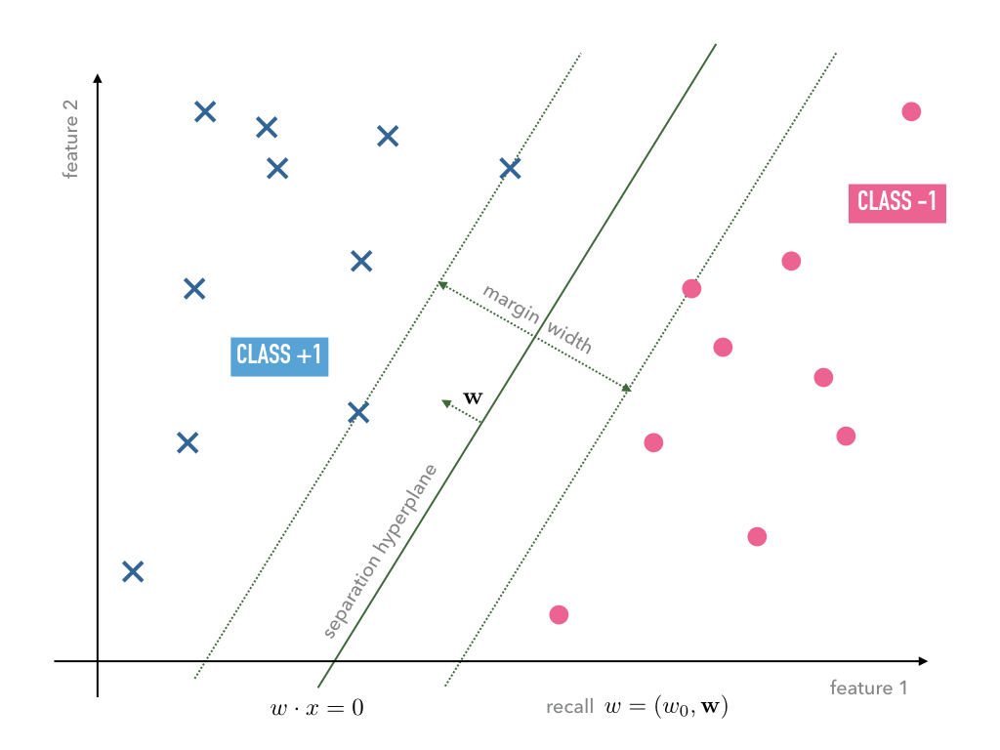
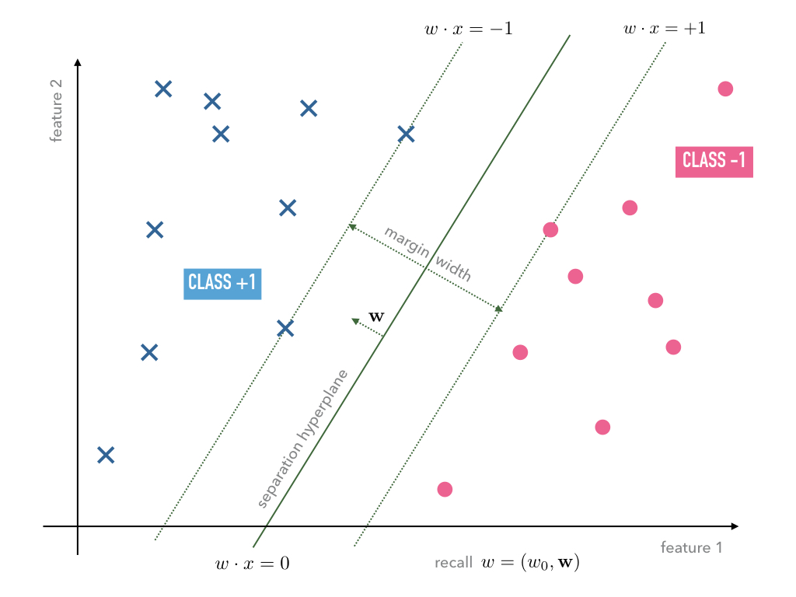
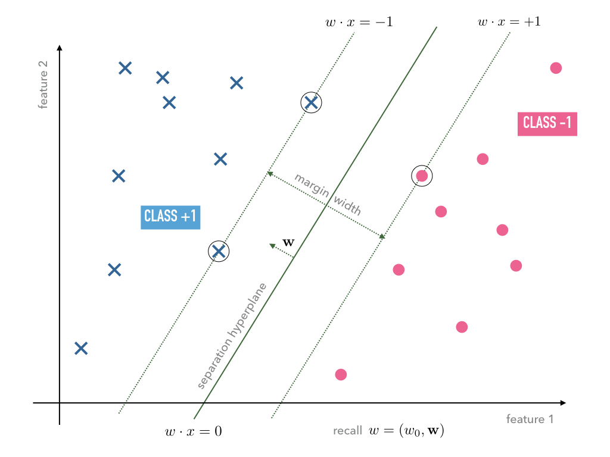
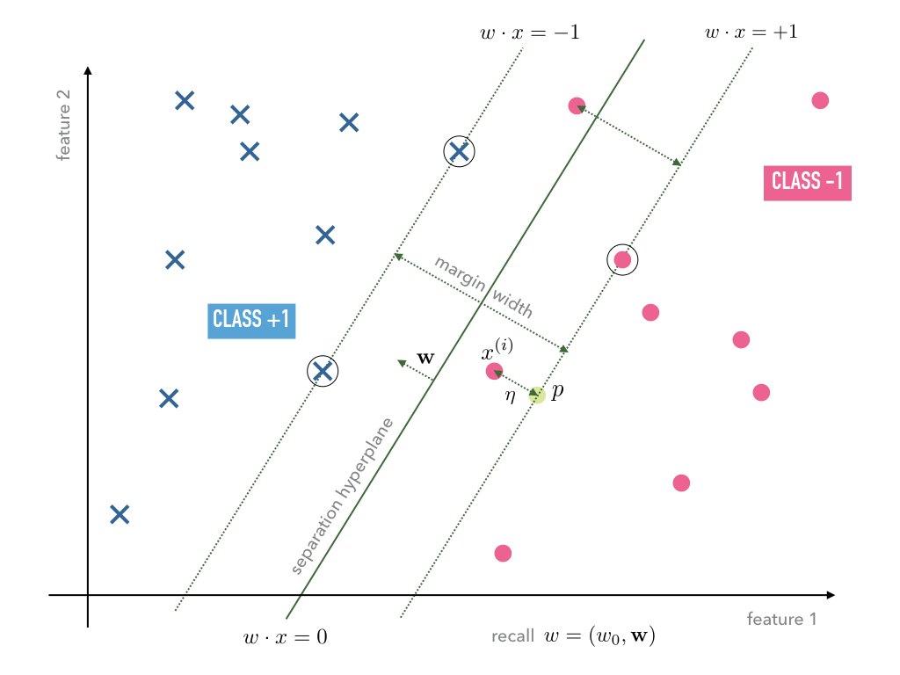

.. highlight:: python
    :linenothreshold: 3

Where to go from here?
======================

The step from the Perceptron to Adaline mainly brings two advantages:

1. We may make use of analytic optimization theory;
2. We may encode what we mean by 'optimal' weights :math:`w`, i.e., by the
   terms 'accurately' and 'generalizes' of the introductory discussion, by the
   choice of the corresponding loss function.

This freedom leads to a rich class of linear classifiers, parametrized by the
choice of activation function :math:`\alpha(z)` and the form of loss function
:math:`L(w)`. As there is great freedom in this choice we must understood
better how we can encode certain learning objectives in this choice. We shall
look in more detail at two different choice from :eq:`eq-alpha-z` and
:eq:`eq-L` in the next chapters. One of them results in the
industry-proven 'support vector machine' (SVM) model.

.. container:: toggle
        
    .. container:: header
    
        Homework

    .. container:: homework

        1. Discuss how the 'optimal' choice of weights is influence by changing
           the loss function :eq:`eq-L` to

           .. math:: 
       
               L(w) := \|w\|_p + \frac12 \sum_{i=1}^M \left(y^{(i)}
               -\alpha(w\cdot x^{(i)})\right)^2,

           where :math:`\|w\|_p := (\sum_i |w_i|^p)^{1/p}` is the usual
           :math:`L^p`-norm for :math:`p\in \mathbb N\cup\{\infty\}`.

        2. Give an example of a loss function employing a notion of
           distance other than the Euclidean one and implement the
           corresponding Adaline.

Sigmoid activation function
---------------------------

One of the widely employed choices in machine learning models that are based on
the Adaline framework are sigmoid functions. This class of functions is usually
defined as bouded differentiable function :math:`\mathbb R\to\mathbb R` with a
non-negative derivative. Two frequent examples are the logistic function

.. math::
    \alpha: \mathbb Z \to [0,1], \qquad \alpha(z):=\frac{1}{1+e^{-z}}
    :label: eq-logistic

and the hyperbolic tangent

.. math::
    \alpha: \mathbb Z \to [-1,1], \qquad \alpha(z):=\tanh(z) =
    \frac{e^z-e^{-z}}{e^z+e^{-z}}.

.. container:: toggle
        
    .. container:: header
    
        Homework

    .. container:: homework

        Prove that any sigmoid function has a pair of two horizontal
        asymptodes for :math:`x\to\pm\infty`.

Compared to the linear activation in :eq:`eq-alpha-z` these functions often
have several advantages. 

First, their ranges are bounded by definition. In the cases considered above,
in which there are only two class labels, say or :math:`\{0,1\}` or
:math:`\{-1,+1\}`, the linear activation function :eq:`eq-alpha-z` may attain
values much lower or higher that the numbers used to encode the class labels.
This may lead to extreme updates according to the update rule
:eq:`eq-adaline-update` as the difference :math:`(y^{(i)}-\alpha(w\cdot
x^{(i)}))` may become very large. In the Adaline case considered above in which
we only had one output signal we did not encounter problems during training
because of such potentially large signals. On the contrary they were rather
welcome as they pushed the weight vector strongly in the right direction.
However, soon we will discuss the Adaline for multiple output signals
representing a whole layer of neurons, and furthermore, stack them on top of
each other to form multiple-layer networks of neurons. In these situation such
extreme updates will be undesired and the sigmoid function will work to prevent
them. Note that if we then replace the linear activation by the hyperbolic
tangent above, we ensure :math:`(y^{(i)}-\alpha(w\cdot x^{(i)}))\in
(-2,+2)`, i.e., the updates are uniformly bounded as it was the case for the
Perceptron.

Second, the reason to consider multi-layer networks is to treat general
non-linear classification problems and the necessary non-linearity will enter
into the model by means of such non-linear activation functions. 

Although both reasons are more important for the multi-layer networks
considered later, it will be convenient to discuss the training of sigmoidal
Adaline already for the simply case of only one output signal.  Furthermore,
there is a third reason why, e.g., the logistic is often preferred over the linear
activation as the former can be interpreted as a probability.

The implementation of a sigmoidal Adaline is straight forward. We replace the
activation function :math:`\alpha` accordingly, compute its derivative and adapt
the update rule :eq:`eq-adaline-update`.  

.. container:: toggle
            
    .. container:: header
        
        Homework

    .. container:: homework

        Adapt our Adaline implemetation to employ 

        1. the hyperbolic tangent activation function and
        2. the logistic function   

        and observe the corresponding learning behavior. 

The implementation for the Iris data set should work out of the box having
initial weight set to zero. However, one may recognize that the training for
extreme choices of initial weights will require many epochs of training in
order to achieve a reasonable accuracy. The following plots illustrate the
learning behavior of a linear and hyperbolic tangent Adaline: 

.. plot:: ./figures/python/sigmoid-saturation.py
    :width: 80%
    :align: center

Both plots show the quadratic loss functions :eq:`eq-L` per iteration of
training of a linear (left) and a hyperbolic tangent (right) Adaline. Both
started with an initial weight of :math:`-3` and were presented the signle
training data element :math:`(x^{(1)},y^{(i)})=(1,1)`. The initial weight
was chosen far off a reasonable value. Nevertheless, the linear Adaline
learns to adjust the weight rather quickly while the hyperbolic tangent
Adaline takes about more than two magnitudes more iteration before a
significant learning progress can be observed.

For simplicity and to draw a nice connection to statistics, let us look
at the logistic Adaline model, i.e., the Adaline model with :math:`\alpha(z)`
being the logistic function :eq:`eq-logistic`. The same line of reasoning that
will be developed for the logistic Adaline will apply to the hyperbolic tangent
Adaline in the plot above.
  
Looking at our update rule :eq:`eq-adaline-update` we can read off the
explanation for the slow learning phenomenon. Recall the update rule:
                     
.. math:: w \mapsto w^{\text{new}} := w + \eta \sum_{i=1}^M \left(
   y^{(i)}-\alpha(w\cdot x^{(i)}) \right) \alpha'(w\cdot x^{(i)}) x^{(i)} 

and the derivative of the logistic function :eq:`eq-logistic`:

.. math::
    \alpha'(z) = \frac{e^{-z}}{(1+e^{-z})^2}=\alpha(z)(1-\alpha(z)).
    :label: eq-logistic-derivative

Clearly, for large values of :math:`z` the derivative :math:`\alpha'(z)`
becomes very small, and hence, the update computed by the update rule
:eq:`eq-adaline-update` will be accordingly small even for the case of a
misclassification. This is why this phenomenon is usually referred to as
*vanishig gradient problem*.

If, for whatever reason, we would like to stick with the logistic function as
activation function we can only try to adapt the loss function :math:`L(w)` in
order to better the situation. How can this be done? Let us restrict our
consideration to loss functions of the form

.. math::
    L(w) = \sum_{i=1}^M l(y^{(i)},\alpha(w\cdot x^{(i)});
    :label: eq-loss-small-l

note that with

.. math::
    l(y,x) := \frac12 (y-x)^2
    :label: eq_l_quadratic

the form :eq:`eq-loss-small-l` reproduces exactly the form of the quadratic loss function given in
:eq:`eq-L`. We compute

.. math::
   \frac{\partial L(w)}{\partial w} 
   = 
   \sum_{i=1}^M \frac{\partial l}{\partial z}(y^{(i)},z)
   \big|_{z=\alpha(w\cdot x^{(i)})}
   \cdot \alpha'(w\cdot x^{(i)}) \, x^{(i)}.
   :label: eq-update-small-l

This means that the only choice to compensate a potential vanishing gradient
due to :math:`\alpha'` is to choose a good function :math:`l`. Bluntly, this
could be done by choosing :math:`\frac{\partial l}{\partial z}(y^{(i)},z)
\big|_{z=\alpha(w\cdot x^{(i)})}` to be proportional to the inverse of
:math:`\alpha'(w\cdot x^{(i)})` and then integrating it -- hoping to find a
useful loss function for the training objective. We will not follow this route
this but make a detour and use this opportunity to motivate a good candidate of
the loss function by ideas drawn from statistics. The direct way, however,
makes up a good homework and stands for its own as it is independent of the
heuristics. 

For this purpose we introduce the concept of *entropy* and *cross-entropy*. We
define:

.. container:: definition

    **Definition (Entropy)** Given a discreet probability space
    :math:`(\Omega,P)` we define the so-called entropy by

    .. math::
        H(P) := \sum_{\omega \in \Omega} P(\omega) \, (-1)\, \log_2 P(\omega).

Note that :math:`P(\omega)\in[0,1]` but the sum is to be understood as summing
only over :math:`\omega` such that :math:`P(\omega)>0`.  when excluding events
of probability zero as they since they would not have to to be encoded anyway.
Heuristically speaking, the entropy function :math:`H(P)` measures how many
bits are on average necessary to encode an event. Say Alice and Bob want to
distinguish a number of :math:`|\Omega|=N` events but only have a communication
channel through which one bit per communication can be send. An encoding scheme
that is able distinguish :math:`N` events but on average minimizes the number
of communications between Alice and Bob would allocate small bit sequences for
frequent events and longer ones for infrequent ones. The frequency of an event
:math:`\omega\in\Omega` is is determined by :math:`P(\omega)` so that the best
strategy to minimize the average number of bits per event is to to allocate for
event :math:`\omega` a number of :math:`-\log_2(P(\omega))` bits.  

Let us regard a three examples:

1. *A fair coin:* The corresponding probability space can be modelled
   by

   .. math::
       \Omega = \{0,1\}, \qquad \text{and} \qquad \forall \omega\in\Omega: \quad
       P(\Omega):=\frac{1}{2}

   so that we find

   .. math::
       H(P) = -\sum_{\omega\in\{0,1\}}P(\omega)(-1)\log_2(P(\omega))=-\log_2\frac12 = 1.

   Hence, on average we need 1 bit to store the events as typically we have 0
   or 1.

2. *A fair six-sided dice:* The corresponding probability space can be modelled
   by

   .. math::
       \Omega = \{1,2,3,4,5,6\}, \qquad \text{and} \qquad \forall \omega\in\Omega: 
       \quad P_\text{fair}(\omega):=\frac{1}{6}

   and we find

   .. math::
       H(P_\text{fair}) = \sum_{\omega\in\{1,2,3,4,5,6\}}P(\omega)(-1)\log_2(P(\omega)) 
       = -\log_2\frac{1}{6} \approx 2.58\ldots.

   Hence, on average we need 3 bits to store which of the six typical events
   occurred.

3. *An unfair six-sided dice:* Let us take again :math:`\Omega=\{1,2,3,4,5,6\}`
   but instead of the uniform distribution like above we chose:

   +---------------------------------+-------------+--------------+--------------+--------------+--------------+-------------+
   | :math:`\omega`                  | :math:`1`   | :math:`2`    | :math:`3`    | :math:`4`    | :math:`5`    | :math:`6`   |
   +---------------------------------+-------------+--------------+--------------+--------------+--------------+-------------+
   | :math:`P_\text{unfair}(\omega)` | :math:`1/4` | :math:`1/16` | :math:`1/16` | :math:`1/16` | :math:`1/16` | :math:`1/2` |
   +---------------------------------+-------------+--------------+--------------+--------------+--------------+-------------+

   In this case we find

   .. math::
       H(P_\text{unfair}) =
       \sum_{\omega\in\{1,2,3,4,5,6\}}P(\omega)(-1)\log_2(P(\omega)) =
       -\log_2\frac{1}{6}= 2

   Since typically event :math:`\omega=6` occurs more often then the others we
   may afford to allocate less bits to represent it. The price to pay is to
   allocate more bits for the less frequent events. However, weighting with the
   relative frequency, i.e., on average, such an allocation turns out to
   require less bits per event to be transmitted through Alice and Bob's
   communication channel. In particular, on average, they need less bits than
   in the case of the fair dice. 

In statistics the actual probability measure :math:`P` is usually unknown and the
objective is to find a good estimate :math:`Q` of it taking in account the empirical
evidence. A candidate for a measure of how good such a guess is is given by the
so-called *cross-entropy* which we define now.

.. container:: definition

    **Definition (Entropy)** Given a discreet probability space
    :math:`(\Omega,P)` and another measure :math:`Q`  we define the so-called
    cross-entropy by

    .. math::
        H(P,Q) := \sum_{\omega \in \Omega} P(\omega) \, (-1)\, \log_2 Q(\omega).

One may interpret :math:`H(P,Q)` as follows: If :math:`Q` is an estimate of the
actual probability measure then :math:`-\log_2 Q(\omega)` is the number of bits
necessary to encode the event :math:`\omega` according to this estimate. The
cross-entropy :math:`H(P,Q)` is therefore an average w.r.t. to the actual
measure :math:`P` of the number of bits needed to encode the events
:math:`\omega\in\Omega` according to :math:`Q`.  If according to :math:`Q` we
would allocate the wrong amount of bits to encode the events Alice and Bob
would on average have to exchange more bits per communication. This indicates
that :math:`H(P,P)=H(P)` must be the optimum which is actual:

.. container:: theorem

    **Theorem (Cross-Entropy)** Let :math:`(\Omega,P)` be a discreet
    probability space and :math:`Q` another measure on :math:`\Omega`. Then we
    have:

    .. math::
        H(P,Q) \geq H(P,P).

.. container:: toggle
        
    .. container:: header
    
        Homework

    .. container:: homework

       Prove the theorem. *Hint:* Consider first the case of only two possible
       events, i.e., :math:`|\Omega|=2` and find the global minimum.

This property qualifies :math:`H(P,Q)` as a kind of distance between a
potential guess :math:`Q` of the true probability :math:`P`.  After this
excursion to statistics let us employ this distance and with it build a loss
function for the logistic Adaline by the following analogy.

For the logistic Adaline we assume the labels for features :math:`x^{(i)}` to be
of the form :math:`y^{(i)}\in\{0,1\}`, :math:`1\leq i\leq M`. Furthermore, we
observe that by definition also the activation functions evaluate to
:math:`\alpha(w\cdot x^{(i)})\in(0,1)`. This allows to define for the sample space

.. math:: 
    \Omega=\left\{\,\{x^{(i)} \text{ drawn and label is } 1\}\, \,\big|\,1\leq i\leq M\right\}
    \bigcup\left\{\,\{x^{(i)} \text{ drawn and label is } 0\}\, \,\big|\,1\leq i\leq M\right\}

and the following probability distributions, i.e., the actual one (assuming the
training data was labeled correctly and the :math:`x^{(i)}` are drawn with a
uniform distribution), 

.. math::
    P(\{x^{(i)} \text{ drawn and label is } 1\}) & = \frac{y^{(i)}}{M} \\
    P(\{x^{(i)} \text{ drawn and label is } 0\}) &= \frac{1-y^{(i)}}{M}

and the neuron's guess (which for sake of the probabilistic analogy 
we interpret as a probability),

.. math::
    Q(\{x^{(i)} \text{ drawn and label is } 1\}) &= \frac{\alpha(w\cdot x^{(i)})}{M} \\ 
    Q(\{x^{(i)} \text{ drawn and label is } 0\}) &=\frac{1-\alpha(w\cdot x^{(i)})}{M}.

In order to measure the discrepancy between the actual measure
:math:`P` and the guess :math:`Q` we employ the cross-entropy, which in our
case, is defined as 

.. math::
   H(P,Q) &= 
   \sum_{\omega\in\Omega} P(\omega)\log_2 Q(\omega)\\
   &=
   \frac{1}{\log 2}
   \left(
   1-\frac{1}{M} \sum_{i=1}^M 
   \left(
        y^{(i)} 
        \log(\alpha(w\cdot x^{(i)})
        +(1-y^{(i)})
        \log(1-\alpha(w\cdot x^{(i)})
   \right) \right).

Dropping the irrelevant constants we may define a new loss function
:math:`L(w)` by using the following expression for :eq:`eq-loss-small-l`

.. math::
    l(y, \alpha(w\cdot x))
    :=  y \log(\alpha(w\cdot x) +(1-y) \log(1-\alpha(w\cdot x)
    :label: eq_l_crossentropy

so that we get

.. math::
    L(w)= -\frac{1}{M} \sum_{i=1}^M \left(
        y^{(i)} 
        \log(\alpha(w\cdot x^{(i)})
        +(1-y^{(i)})
        \log(1-\alpha(w\cdot x^{(i)})
    \right).

Using :eq:`eq-logistic-derivative` we compute the derivative

.. math::
    \frac{\partial L(w)}{\partial w}
    &=
    -\sum_{i=1}^M
    \left(
        \frac{y^{(i)}}{\alpha(w\cdot x^{(i)})}
        -\frac{1-y^{(i)}}{1-\alpha(w\cdot x^{(i)})}
    \right)
    \alpha'(w\cdot x^{(i)})\, x^{(i)}\\
    &=
    -\left(
        \frac{y^{(i)}}{\alpha(w\cdot x^{(i)})}
        -\frac{1-y^{(i)}}{1-\alpha(w\cdot x^{(i)})}
    \right)
    \alpha(w\cdot x^{(i)})(1-\alpha(w\cdot x^{(i)}))\, x^{(i)}\\
    &=
    \sum_{i=1}^M
    \left(
        \alpha(w\cdot x^{(i)})-y^{(i)} 
    \right)\,x^{(i)}.

We observe, that the vanishing gradient behavior of :math:`\alpha'` is
compensated by the derivative of the cross-entropy :math:`l'`. In conclusion,
we find the update rule corresponding to this new loss function

.. math:: w \mapsto w^{\text{new}} := w + \eta 
    \sum_{i=1}^M
    \left(
        \alpha(w\cdot x^{(i)})-y^{(i)} x^{(i)}
    \right).

A comparison with the previous update rule :eq:`eq-update-small-l` shows that
with the help of a change of loss function we end up with a update rule that
will not show the vanishing gradient problem. As a rule of thumb one can expect
that logistic Adalines will almost always be easier to train with cross entropy
loss functions unless the vanishing gradient effect is desired -- at a
later point we may come back to this point and discuss that, e.g., in
convolution networks the ReLu activation function (being zero for negative
arguments and linear for positive ones) have actually proven to be very
convenient. For now the take away from this section is that the choices in
:math:`\alpha(z)` and :math:`L(w)` must be carefully tuned w.r.t. each other.

.. container:: toggle
            
    .. container:: header
        
        Homework

    .. container:: homework

        Adapt our Adaline implemetation with the logistic activation function
        and replace the old loss function by the cross-entropy and compare the
        learning behavior in both cases. 

Support Vector Machine
----------------------

While the Adaline loss functions :eq:`eq-loss-small-l` for the quadratic loss
:eq:`eq_l_quadratic` or cross-entropy loss :eq:`eq_l_crossentropy` were good
measures of how accurately the training data is classified that can be used for
optimization in terms of gradient descent, they did not put a particular
emphasis on how the optimal weights :math:`w` may lead to a good generalization
from the classification of "seen" training data to "unseen" data we may want to
classify in the future. In the next model we shall specify such a sense and
derive a corresponding loss function. 

Hard Margin Case
~~~~~~~~~~~~~~~~

Consider a typical linear separable case of training data. Depending on the
initial weights both, the Adaline and Perceptron, may find separating
hyperplanes of the same training data, however, the hyperplanes are usually not
unique. Among all possible hyperplanes it may make sense to choose the one that
maximizes the margin width as, e.g., shown in Figure :numref:`fig_hard_margin`.

.. _fig_hard_margin:

    Linear separable data with a separating hyperplane that maximizes the
    margin width.

In order to set up an optimization program that maximizes the margin width, let
us compute the distance between a data point :math:`x^{(i)}=(1,\mathbf
x^{(i)})` and the hyperplane :math:`w=(w^0,\mathbf w)`. For this purpose we
exploit that the vector :math:`\mathbf w` is the normal vector on the plane.
Hence, the straight line in direction of the normal vector :math:`\mathbf w`
through the point :math:`\mathbf x^{(i)}` may be parametrized as follows

.. math::
    x:\mathbb R\to\mathbb R^{n+1}, \qquad x(\alpha):= x^{(i)} + \alpha 
    \begin{pmatrix}
        0\\
        \mathbf w
    \end{pmatrix}
    .
    :label: eq_straight_line

Recall again that the first coefficient in the :math:`\mathbb R^{n+1}` vector
was chosen to remain equal one by our convention. Furthermore, by definition,
all points :math:`x^*` on the hyperplane :math:`w` fulfill 

.. math:: w\cdot x^* = 0.

Hence, we have to solve the equation

.. math::
    0 = w\cdot (1,\mathbf x(\alpha)) 
    = w^0 + \mathbf w\cdot\mathbf x^{(i)} + \alpha\,\mathbf w^2 = w\cdot x^{(i)} +
    \alpha\,\|\mathbf w\|^2
   
for :math:`\alpha` in order to compute the intersection point :math:`x^*`
between the straight line :eq:`eq_straight_line` and the hyperplane :math:`w`:

.. math::
    x^*= x(\alpha) \qquad\text{for}\qquad \alpha 
    =  - \frac{w\cdot x^{(i)}}{\|\mathbf w\|^2}.

The distance can then be computed by taking the difference

.. math::
    \operatorname{dist_w}(x) := \|x^{(i)}-x^*\|

which results in

.. math::
    \operatorname{dist_w}(x^{(i)}) 
    = \left\| \alpha \begin{pmatrix} 0\\ \mathbf w\end{pmatrix} \right\|
    = \frac{|w\cdot x^{(i)}|}{\|\mathbf w\|}.

Any optimization program should, hence, choose a hyperplane :math:`w` that 
classifies the data points correctly according to their labels :math:`y^{(i)}`
while trying to maximize the distance :math:`\operatorname{dist_w}(x^{(j)})`
for such :math:`j` whose corresponding data points :math:`x^{(j)}` lie within
minimal distance to the hyperplane -- such points will in the following be
called *support vectors*, hence, the name *support vector machine*.  In order
to make this notion precise without complicating the equations, we may exploit
the scale invariance of the hyperplane equation :math:`w\cdot x=0` which may be
build into the norm of :math:`w` and simply define the minimal distance between
the nearest data points :math:`x^{(i)}` to the hyperplane :math:`w` equal to
one so that all other distances are measured in this unit. 

    With a weight vector :math:`w` on a scale such that the margin width equals
    :math:`2`.

On that scale, support vectors :math:`x^{(j)}` fulfill

.. math::
    w\cdot x^{(j)} = \pm 1

so that

.. math::
    \operatorname{dist_w}(x^{(j)}) 
    = \|\mathbf w\|^{-1}.

    The circled data points denote the support vectors. 

Using this, we can formulate the constraints as we must require that the
distance of any data point :math:`x^{(i)}` to the respective hyperplane
:math:`w\cdot x^{(i)}=y^{(i)}` is larger or equal one. Hence, we may formulate
the optimization program as

.. math::
    \underset{w\in\mathbb R^{n+1}}{\text{maximize}} \quad \|\mathbf w\|^{-1}
    \qquad
    \text{subject to}
    \qquad \begin{cases}
        y^{(i)}\, w\cdot x^{(i)} \geq 1
        \\
        \text{for } 1\leq i\leq M
    \end{cases}
    .

If we prefer, this program is equivalent to

.. math::
    \underset{w\in\mathbb R^{n+1}}{\text{minimize}} \quad \|\mathbf w\|
    \qquad
    \text{subject to}
    \qquad \begin{cases}
        y^{(i)}\, w\cdot x^{(i)} \geq 1
        \\
        \text{for } 1\leq i\leq M
    \end{cases}
    .
    :label: eq_hard_margin

Note that the type of optimization is different to the one we have employed for
the Adaline since now we need obey certain constraints during the optimization.
Before we get to an implementation let us regard a useful generalization of
this so-called *hard margin* case in which we do not allow any violation of the
margin width.
    
Soft Margin Case
~~~~~~~~~~~~~~~~

The optimization program :eq:`eq_hard_margin` is very dependent on the
fluctuation of data points near the margin. Possible outliers in the training
data near or within the margin dictate how the "optimal" weights :math:`w` have
to be chosen. To reduce this dependency we shall extend the hard margin program
to the so-called *soft-margine* program as follows.

Let us in general allow margin violations but include in the optimization
program that those have to be minimized. Suppose :math:`x^{(i)}` violates the
margin width. This means that either

* :math:`0\leq y^{(i)}\, w\cdot x^{(i)} \leq 1` in which case it is only a
  margin violation but not a misclassification or
* :math:`y^{(i)}\, w\cdot x^{(i)} > 1` in which case it is a margin violation
  that leads to a misclassification,

which are illustrated in the following Figure :numref:`fig_soft_margin`

.. _fig_soft_margin:

    Illustration of one misclassification and one simple margin violation.

The depth of a potential margin violation of data point :math:`x^{(i)}` can be
computed following the same strategy as above. First, we compute the orthogonal
projection :math:`p` of :math:`x^{(i)}` onto the hyperplane :math:`y^{(i)}\,
w\cdot x=1` as depicted in Figure :numref:`fig_soft_margin`, i.e., the point
:math:`p` is given by the intersection of the straight line

.. math::
    x:\mathbb R\to\mathbb R^{n+1}, \qquad x(\alpha):= x^{(i)} + \alpha 
    \begin{pmatrix}
        0\\
        \mathbf w
    \end{pmatrix}

and the hyperplane

.. math::
   y^{(i)} w\cdot x = 1.

Hence, we have to solve the equation

.. math::
    y^{(i)} w\cdot x(\alpha) = 1

for :math:`\alpha` which gives

.. math::
   \alpha = \frac{1 - y^{(i)}\,w\cdot x^{(i)}}{\|\mathbf w\|^2}.

The depth of the margin violation is then given by the distance

.. math::

    \eta^{(i)} = \|p - x^{(i)}\|=\frac{1 - y^{(i)}\,w\cdot x^{(i)}}{\|\mathbf w\|}.

In order to allow for margin violations but also minimize them, we may now set up
the following optimization program

.. math::
    \underset{w\in\mathbb R^{n+1},\xi^{(i)}\geq 0, 1\leq i
    \leq M}{\text{minimize}} \quad \|\mathbf w\| +
    \sum_{i=1}^M \eta^{(i)}
    \qquad
    \text{subject to}
    \qquad \begin{cases}
        y^{(i)}\, w\cdot x^{(i)} \geq 1 - \|\mathbf w\|\, \eta^{(i)} 
        \\
        \text{for } 1\leq i\leq M
    \end{cases}
    .

If we now change the scale once more to units of :math:`\|\mathbf w\|^{-1}` the
program can be stated equivalently as

.. math::
    \underset{w\in\mathbb R^{n+1},\xi^{(i)}\geq 0, 1\leq i
    \leq M}{\text{minimize}} \quad \|\mathbf w\|^2
    + \sum_{i=1}^M \xi^{(i)}
    \qquad
    \text{subject to}
    \qquad \begin{cases}
        y^{(i)}\, w\cdot x^{(i)} \geq 1 - \xi^{(i)} 
        \\
        \text{for } 1\leq i\leq M
    \end{cases}
    .
    :label: eq_soft_margin

Implementation
~~~~~~~~~~~~~~

In order to arrive at our first naive implementation of the support vector
machine for the soft margin case, we need to implement a version of the
optimization program :eq:`eq_soft_margin` and we shall do so in the spirit of
the Adaline model. Later we will see that this can be done much more elegantly
by reformulating the optimization program.

For this purpose we need a loss function to mimic the behavior of the program
:eq:`eq_soft_margin`. A good candidate for this is given by

.. math::
    L(w) = \frac{1}{2}\|\mathbf w\|^2 + \frac{\mu}{M}\sum_{i=1}^M
    \max\{0, 1-y^{(i)}\,w\cdot x^{(i)}\},
    :label: eq_svm_loss

where :math:`\max S` denotes the maximum of a set :math:`S`, :math:`\mu` is a
parameter that controls the weight with respect to which the minimization of
:math:`\|\mathbf w\|^2` is prioritized over the minimization of the
accumulative margin violation. The factor :math:`\frac12` is just decoration,
of course, and only kept because you will see it in many textbooks.

We may now be tempted to readily apply a gradient descent algorithm in order to
find optimal weights :math:`w`. However, we recall that for this we need
:math:`L(w)` to be a differentiable function of :math:`w` and due to the
:math:`\max` function this is not the case. Nevertheless, we can approximate
the derivative by means of a suitable candidate of its subdifferential. For
example, we may simple set approximate gradient to be

.. math::
    \operatorname{grad}L(w) 
    := 
    \|\mathbf w\| - \frac{\mu}{M}\sum_{i=1}^M y^{(i)}\, x^{(i)} 
    \, \max\{0, 1-y^{(i)}\,w\cdot x^{(i)}\}
    :label: eq_svm_gradient

and use the update rule

.. math::
    w\mapsto w^{\text{new}} := w - \eta \operatorname{grad} L(w)

for some learning parameter :math:`\eta\in\mathbb R^+`.  To render the
implementation of the update rule more transparent let us first create a class
of methods that performs the computation of the loss function :eq:`eq_svm_loss`
as well as the approximate gradient :eq:`eq_svm_gradient`::

    class LossSVM:

        def __init__(self, X_train, Y_train, mu=1.0):
        """
        Initialize the parameter `mu` which specifies the weighting 
        between margin width and the distance to the support vectors, and
        furthermore, the training data `X_train` and `Y_train`.
        """

           self.mu_ = mu

           self.xi_ = X_train
           self.yi_ = Y_train
        
           return

        def val(self, w):
           """
           Computes a value of the loss function for a given weight vector.
           """
        
           self.margin = 1 - self.yi_ * ( np.dot(self.xi_, w[1:]) + w[0] )
 
           w_norm = 1/2 * np.sum( w[1:]**2 ) 
           margin_violations = np.where(self.margin >= 0, self.margin, 0) 
           margin_avg = margin_violations.sum() / len(self.xi_)

           return w_norm + self.mu_ * margin_avg

        def diff(self, w):
           """
           Computes the derivative of the loss function for a given weight vector.
           """
        
           self.margin = 1 - self.yi_ * ( np.dot(self.xi_, w[1:]) + w[0] )
        
           w0_sub_diff1 = - self.yi_
           w0_sub_diffs = np.where(self.margin >= 0, w0_sub_diff1, 0) 
           w0_diffs_avg = w0_sub_diffs.sum() / len(self.xi_)

           w_sub_diff1 = - self.xi_ * self.yi_[:,np.newaxis]
           w_sub_diffs = np.where(self.margin[:,np.newaxis] >= 0, w_sub_diff1, 0) 
           w_diffs_avg = w_sub_diffs.sum(axis=0) / len(self.xi_)

           ret0 = np.array([ w0_diffs_avg ])
           ret_vec = w[1:] + self.mu_ * w_diffs_avg

           return np.append(ret0, ret_vec)

* This class expects the training data as arguments `X_train` and `Y_train` in
  the constructor in line 3;
* The `val()` method in line 15 determines the value of the loss function for
  the training data specified in the constructor;
* Furthermore, the method `diff()` computes the approximate derivative stated
  in :eq:`eq_svm_gradient`.

The rest of the implementation follows the Adline one except, of course, that
the learning rule has to be replaced::

    def learn(self, X_train, Y_train, mu=1.0, eta=0.01, epochs=1000):
        '''
        fit training data according to eta and n_iter
        and log the errors in errors_
        '''

        # we initialize two list, each for the misclassifications and the cost function
        self.train_errors_ = []
        self.train_loss_ = []

        # for all the epoch
        for _ in range(epochs):
            # classify the traning features
            Z = self.classify(X_train)
            # count the misqualifications for the logging
            err = 0
            for z, y in zip(Z, Y_train):
                err += int(z != y)
            # ans save them in the list for later use
            self.train_errors_.append(err)

            loss = LossSVM(X_train, Y_train, mu=mu)
            # compute loss for this epoch
            self.train_loss_.append( loss.val(self.w_) )  
            # compute gradient of loss function and with it the update for w
            delta_w = - eta * loss.diff(self.w_)
            # update the weights
            self.w_ += delta_w

        return     

* The `LossSVM` class that we defined above is instantiated with `loss` in the
  main loop and the entire training data is passed to its constructor;
* The computation of the loss function is carried out in line 24 while the
  update happens in line 26.

.. container:: sourcecode

    **SOURCECODE:** `where_to_go/iris_svm.ipynb <https://github.com/dirk-deckert/MAML/blob/master/src/where_to_go/iris_svm.ipynb>`_ 
        
    The full implementation of the 'naive' version of the support vector
    machine.
    
    **SOURCECODE:** `where_to_go/iris_svm_convergence.ipynb <https://github.com/dirk-deckert/MAML/blob/master/src/where_to_go/iris_svm_convergence.ipynb>`_ 
        
    These are the same test scenarios that we used to observe the learning
    behavior for the Perceptron and Adaline.

    .. container:: toggle

        .. container:: header

            Homework

        .. container:: homework

            Implement the support vector machine as mini-batch learner and play
            with the two parameters `mu` and `eta` in scenarios that feature
            margin violations in order to get a feeling about their influence.
